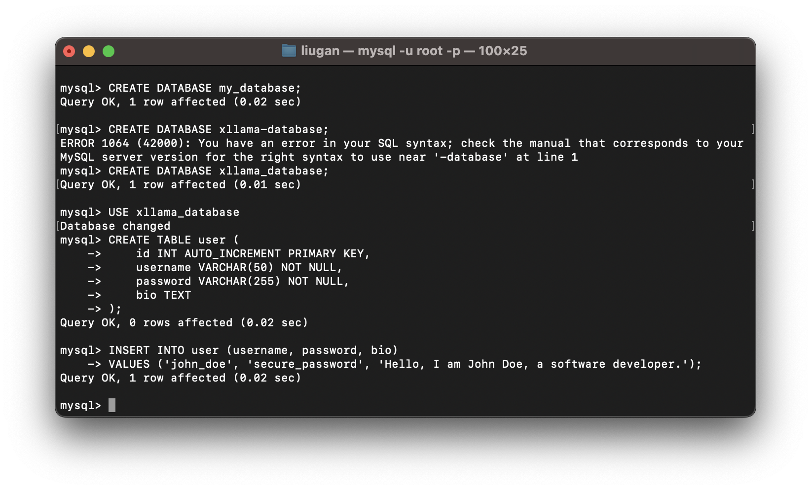
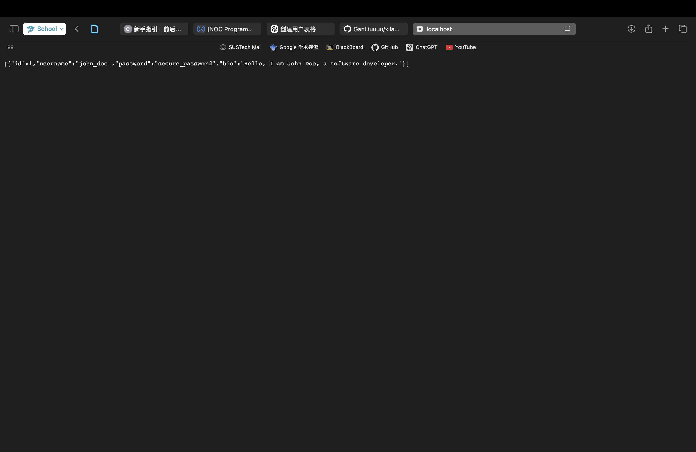

# 🦙 X Llama: A Vite + Vue + SCSS Conversational Platform

Welcome to **X Llama**! 🦙 This project is a conversational platform built using **Vite**, **Vue**, and **SCSS**, designed for seamless interaction with large language models (LLMs). The project is part of an Object-Oriented Programming course, offering a modern UI with a sidebar layout inspired by contemporary design trends and utilizing fonts and icons from **Google Fonts**.

## 🚀 Project Overview

X Llama provides a dynamic, user-friendly platform where users can interact with both official and custom bots. The platform supports two distinct user roles: **System Administrators** and **Regular Users**, each with different functionalities and privileges.

### 👥 User Roles:

- **System Administrators**: Manage bots, set usage limits, adjust pricing, and control access for users.
- **Regular Users**: Interact with bots and create or customize their own bots for specific purposes.

### 🤖 Bot Module:

- **Official Bots**: Access models like ChatGPT-3.5 turbo, ChatGPT-4o, and ChatGPT-4o-mini.
- **Custom Bots**: Build and personalize bots with special functions, such as translation, image generation, or mathematical calculations.

### 💬 Conversation Features:

- **Single-turn and Multi-turn Q&A**: Real-time response streaming with optional context clearing.
- **Advanced Custom Bot Settings**: Customize bots with external knowledge, prompts, and improved interaction features.

### 🛠️ Administrator Features:

- Manage bot data: Add or modify bots, set pricing, and manage quotas for custom bots.
- Export data: Retrieve statistics on user activity, bot interactions, and revenue.

### 💸 Marketplace Module:

- Purchase tokens to interact with bots. When tokens run out, users can switch to free bots (ChatGPT-3.5 turbo).

### ⭐ Ratings and Search Modules:

- **Search**: Fuzzy search for users and bots.
- **Ratings and Comments**: Users can rate bots and leave feedback.

### 🌟 Advanced Features

- **Popularity Rankings**: Display and rank top bots by ratings and visits.
- **Recommendations**: Suggest bots based on user behavior.
- **Multiple Query Formats**: Support for text, images, files, and voice inputs.
- **Prompt Refinement**: Provide advanced tools to enhance query quality.

## How to run the project

### Server

本项目采用 Spring Boot + Vue 前后端分离的架构，Spring Boot 负责处理后端逻辑并与 MySQL 数据库交互。该部分对后端部分进行说明，并提供开发指引。

#### Quick Start(Server)

在本地下载并配置 MySQL，将初始密码设置为 `xllama123`。配置完成后，使用命令行或可视化工具（如 Navicat）创建数据库和表。

##### 1. 创建数据库

使用以下 SQL 语句创建数据库：

```sql
CREATE DATABASE xllama_database;
```

##### 2. 选择数据库

创建数据库后，使用以下语句选择你刚创建的数据库：

```sql
USE xllama_database;
```

##### 3. 创建表

使用以下 SQL 语句在数据库中创建 `user` 表：

```sql
CREATE TABLE user (
    id INT AUTO_INCREMENT PRIMARY KEY,
    username VARCHAR(50) NOT NULL,
    password VARCHAR(255) NOT NULL,
    bio TEXT
);
```

##### 4. 插入测试数据

在 `user` 表中插入一条测试数据，方便后续测试：

```sql
INSERT INTO user (username, password, bio) 
VALUES ('john_doe', 'secure_password', 'Hello, I am John Doe, a software developer.');
```

所有操作如下图所示：



##### 5. 运行后端程序

```
git clone https://github.com/GanLiuuuu/xllama-server.git
```

Clone 后端代码并在 IDE 中打开。成功启动项目后，访问 `localhost:8081/user/getAll`，你应该能够看到之前插入的测试数据，如下图所示：



如遇到依赖问题，请在群里讨论。

### Client

The client is built using Vue, with axios added as a dependency for data transmission between the front-end and back-end.

Install dependencies:

```
npm i
```

Run the client:

```
npm run dev
```

### Server + Client Integration

After completing all the previous steps (primarily setting up the MySQL database), the general development workflow is as follows:

```
git clone https://github.com/GanLiuuuu/xllama-client.git
git clone https://github.com/GanLiuuuu/xllama-server.git
```

Open the server in your IDE and run it.

Then run the client:

```
cd xllama-client
npm i
npm run dev
```

Once the front-end and back-end are connected successfully, click on "Settings" in the interface. You should see the data you inserted into the database, completing the front-end and back-end integration. It should look like this: